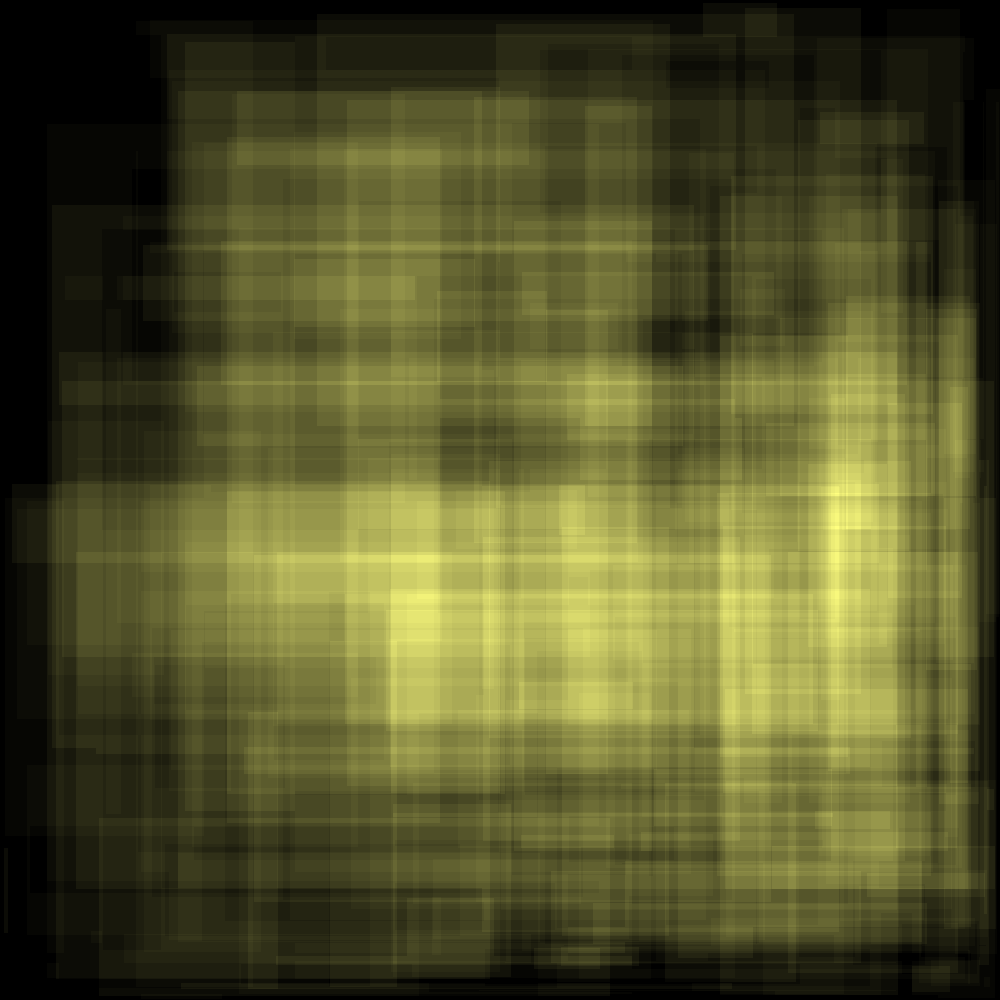

# [Advent Of Code 2015](https://adventofcode.com/2015) in scala

uses:

- scala3
- scala-cli

## How to

```sh
# setup IDE
$ scala-cli setup-ide .

# run the code
$ scala-cli run project.scala . --main-class day${N}.main

# run tests
$ scala-cli test .
```

## Images

|               2015 Day6 Part 1                |                2015 Day6 Part 2                 |
| :-------------------------------------------: | :---------------------------------------------: |
|  |  |
