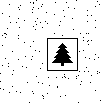

# [Advent Of Code](https://adventofcode.com) in scala


uses:

- scala3
- scala-cli

## How to

```sh
# setup IDE
$ scala-cli setup-ide .

# run the code
$ scala-cli run project.scala . --main-class day${N}.main

# run tests
$ scala-cli test .
```

## Images

|           2015 Day6 Part 1            |           2015 Day6 Part 2           |
| :-----------------------------------: | :----------------------------------: |
|   |  |
|         **2024 Day14 part 2**         |                                      |
|  |                                      |
